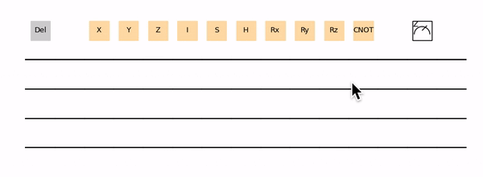
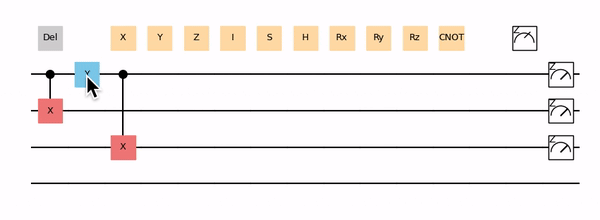

<p align="center">
  <a href="https://github.com/JDEA-Quantum-Lab/TeD-Q">
    
  </a>
</p>

# TeD-Q 
## (Tensor-network enhanced Distributed Quantum)
TeD-Q is an open-source software framework for quantum machine learning, variational quantum algorithm and simulation of quantum computing.

## Main Features
* ***Tensor-network enhanced.*** With tensor contraction, simulation of quantum circuts with large number of qubits is possible.
* ***Hybrid.*** TeD-Q seamlessly integrates classical machine learning libraries with quantum simulators, giving users the ability to laverage the power of classical machine learning while train quantum machine learning models.
* ***Distributed.*** TeD-Q is empowered with the capability of training quantum machine learning models in a distributed manner.
* ***Easy-to-use***. Quantum circuit is seen as a python function.
* ***Device independent***. The circuits can be run on different backends include software simulators (JAX and PyTorch) and quantum hardwares. 
* ***Automatic differentiation.*** Provides back propagation, parameters shift, finite difference methods to obtain gradient.
* ***Flexible interfacing.*** Bridging quantum circuit to powerful machine learning libraries (like PyTorch).
* ***Good compatibility.*** Backend's optimizer can be directly applied.
* ***User friendly visualization.*** Quantum circuit and training progress can be visualized in real time.

## Installation
#### Prerequisite
```
pip install numpy torch jax jaxlib matplotlib panel jupyterlab ipywidgets toolz ray
```
It is strongly recommended to install and use [JDtensorPath](https://github.com/JDEA-Quantum-Lab/JDtensorPath) for tensor network contraction mode.
#### Install
```
pip install -e .
```
#### Test
Run the Run_all_tests.ipynb file under test document

## Getting started
### Simple example
#### Define the circuit with TeD-Q framework
```
import tedq as qai
def circuitDef(params):
    qai.RX(params[0], qubits=[0])
    qai.RY(params[1], qubits=[0])
    return qai.expval(qai.PauliZ(qubits=[0]))
```
#### Quantum circuit constuction
```
number_of_qubits = 1
parameter_shapes = [(2,)]
my_circuit = qai.Circuit(circuitDef, number_of_qubits, parameter_shapes = parameter_shapes)
```
#### Draw the quantum circuit
```
drawer = qai.matplotlib_drawer(my_circuit)
drawer.draw_circuit()
```
#### Compile quantum circuit with "pytorch" backend
```
my_compilecircuit = my_circuit.compilecircuit(backend="pytorch")
```
#### Run the circuit
```
import torch
a = torch.tensor([0.54], requires_grad= True)
b = torch.tensor([0.12], requires_grad= True)
my_params = (a, b)
c = my_compilecircuit(*my_params)
>>> c = tensor([0.8515], grad_fn=<TorchExecuteBackward>)
```
#### Obtain the gradient
```
c.backward()
```

### Getting start with the graphic circuit composer
#### Init the circuit composer in TeD-Q framework
```
%matplotlib ipympl
import tedq as qai

composer = qai.circuit_composer(4, figsize=(10,4))
```
#### Add a quantum gate
Drag the template quantum gate on the bar on the top.



#### Remove a quantum gate
Click the gate on the quantum wire and drag to the trash box.



#### Convert to a circuit object
The composer can be converted to circuit object and compiled for evaluating the circuit.
```
circuit = composer.toCircuit()
compiledcircuit = circuit.compilecircuit(backend="pytorch")
```
#### Show the definition of circuit 
User can also show the circuit definition by printing the circuit object.
```
print(circuit)

```

### Learn more
Follow the tutorial and the examples below to learn more usage of the TeD-Q framework.

## Tutorial and examples
For more diverse examples of using TeD-Q to solve quantum machine learning problem and variational quantum algorithm, please refer to the following tutorials or our official [documentation](https://ted-q.readthedocs.io) website.
#### [Qubit rotation](/examples/Qubit_rotation.ipynb)
#### [QNN circuit example](/examples/QNN_circuit_example.ipynb)
#### [Quanvolution neural network](/examples/Quanvolution_neural_network.ipynb)
#### [Quantum transfer learning](/examples/Quantum_transfer_learning.ipynb)
#### [Expected value and the gradient of parameters](/examples/Expected_value_and_the_gradient_of_parameters.ipynb)
#### [Simple variational quantum eigensolver](/examples/Simple_Variational_Quantum_Eigensolver.ipynb)
#### [1D Many Body Localization](/examples/Many_body_Localization_1D.ipynb)
#### [2D Many Body Localization](/examples/Many_body_Localization_2D.ipynb)

## Authors
TeD-Q is released by JD Explore Academy and currently maintained by [Xingyao Wu](https://github.com/xywu1990). The project is not possible without the efforts made by our [contributors](https://github.com/JDEA-Quantum-Lab/TeD-Q/graphs/contributors).

## License
TeD-Q is free and open source, released under the Apache License, Version 2.0.

